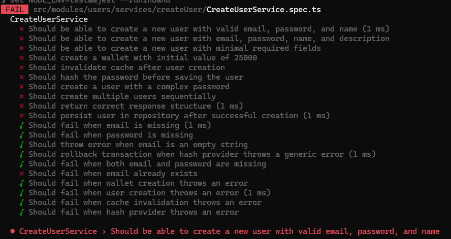


A pull request by modified the email existence validation logic in the CreateUserService.execute method. This change inverted the intended behavior, causing unit tests to fail and allowing duplicate email addresses to be created, which violates the application's requirements.

Code Change

The PR altered the email existence check in the CreateUserService.execute method:

Original Code:

    if (emailExists) {
	    throw new AppError('BAD_REQUEST', 'Email alerady exists', 400);
    }

  
Modified Code (PR):

    if (!emailExists) {
	    throw new AppError('BAD_REQUEST', 'Email alerady exists', 400);
    }

  

Impact

The change inverted the logic:

  

Original Behavior: The service throws an AppError with a 400 status code when the email already exists, preventing duplicate users, as required.

Modified Behavior: The service now throws an error when the email does not exist, rejecting valid new emails and allowing duplicate emails to be created. This breaks the user creation process and violates the requirement to prevent duplicate email addresses.

  

    

